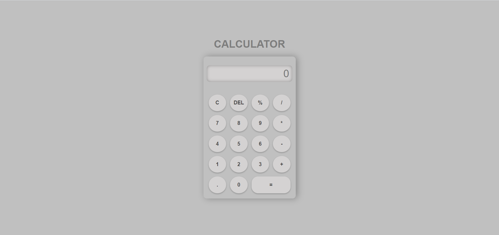

Calculator
=================

Overview
--------

This is a simple web-based calculator designed to perform basic arithmetic operations. The calculator provides a user-friendly interface with a responsive design, making it accessible on various devices.

Features
--------

-   Addition (+), subtraction (-), multiplication (*), and division (/) operations
-   Percentage calculation with efficient handling using regular expressions
-   Clear (C) button to reset the input
-   Delete (DEL) button to remove the last entered digit
-   Stylish and responsive design with a hover effect for better user experience

Screenshots
-----------

*Description: Desktop view*

*Description: mobile view*

How to Use
----------

1.  Enter numerical values using the provided number buttons.
2.  Use the operation buttons (+, -, *, /) for arithmetic calculations.
3.  Manage percentages efficiently using the '%' button.
4.  Clear the input with the 'C' button or remove the last digit with 'DEL'.
5.  Obtain the result by clicking the '=' button.

Code Structure
--------------

-   HTML: Defines the structure of the calculator and includes references to CSS and JavaScript files.
-   CSS (`style.css`): Provides styling for the calculator, ensuring a visually appealing and responsive layout.
-   JavaScript (`script.js`): Implements the calculator's functionality, including input handling, calculation, and result display.

Efficiency in Percentage Calculation
------------------------------------

The calculator efficiently uses eval() and handles percentage calculations using regular expressions (regex). Two regex patterns are applied to cover different scenarios:

1.  Handling cases like "2*8%", where the percentage is applied to a preceding number.
2.  Managing cases like "8%", where the percentage is applied to the last entered number.

Run Locally
-----------

To run the calculator locally, simply download the HTML, CSS, and JavaScript files. Open the HTML file in a web browser to start using the calculator.

Feel free to customize and enhance the calculator according to your needs!

